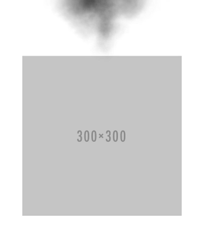

# smoke-element [](https://travis-ci.org/bendrucker/smoke-element) [](https://greenkeeper.io/)

> Make smoke over an element

## Install

```
$ npm install --save smoke-element
```


## Usage



You can run this demo directly:

```sh
npm start
```


```js
var smokeElement = require('smoke-element')
var target = document.createElement('div')

var smoke = smokeElement({element: target})

// start the smoke
smoke.start()

// stop generating new smoke in a second
setTimeout(() => smoke.stop(), 1000)
```

## API

#### `smokeElement(options)` -> `smoke`

##### options

###### element

*Required*  
Type: `HTMLElement`

An element to emit smoke from.

###### colors

Type: `array[number]`  
Default: `[0, 0, 0]`

RGB color values for the smoke. Defaults to black.

## See Also

* [smoke.js](http://www.cssscript.com/interactive-smoke-effect-javascript-canvas-smoke-js/): `<canvas>` smoke generation was adapted from the demo with rewritten state management and drawing methods
* [eaze-menu-fire](https://github.com/bendrucker/eaze-menu-fire): A Chrome extension that uses this library for an easter egg

## License

MIT © [Ben Drucker](http://bendrucker.me)
